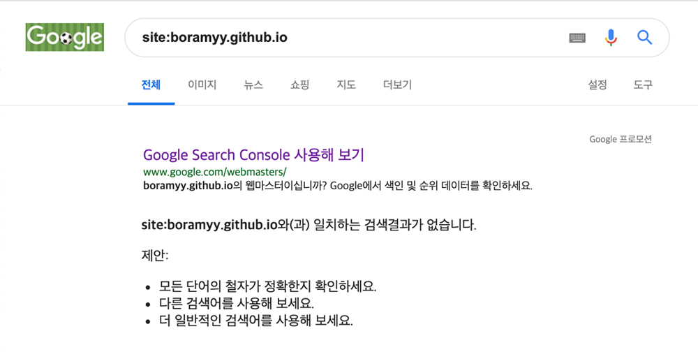

야심차게 블로그를 개설하고 몇개의 글을 올렸다. 구글에 어떻게 나오나 검색해봐야지~ ^0^ <br/>
...
<br/>
안타깝게도 사이트는 검색되지 않았다. 글 뿐만 아니라 블로그 주소를 그대로 쳐도 검색결과에는 내 사이트가 존재하지 않았다..!
<br/>
그래서 어렴풋하게만 알고있던 SEO를 직접 사이트에 실천하기로 했다.

### index

- [검색엔진최적화 SEO(Search Engine Optimization)](#검색엔진최적화-SEO(Search-Engine-Optimization))
- [sitemap.xml 작성하기](#sitemapxml-작성하기)
- [검색엔진에 sitemap.xml 알려주기](#검색엔진에-sitemapxml-알려주기)
- [참고](#참고)


### 검색엔진최적화 SEO(Search Engine Optimization)

구글이나 다음, 네이버 등 검색 사이트의 검색엔진이 내 사이트를 잘 이해할 수 있도록 사이트 내부를 손보는 작업입니다.
우리나라의 대표 검색 사이트인 구글, 다음, 네이버를 기준으로 어떻게 도울 수 있는지 알아보았습니다.


### sitemap.xml 작성하기

root(프로젝트 최상단)에 `sitemap.xml`파일을 생성하고 다음을 작성해줍니다.

``` xml
<?xml version="1.0" encoding="UTF-8"?>

<urlset xmlns="http://www.sitemaps.org/schemas/sitemap/0.9">

   <url>
      <loc>https://boramyy.github.io/</loc>
      <lastmod>2019-05-02</lastmod>
      <changefreq>monthly</changefreq>
      <priority>0.8</priority>
   </url>
   
</urlset> 
```

#### 꼭 있어야하는 필수태그
- `urlset` - 파일을 캡슐화하고 현재 프로토콜 표준을 참조
- `url` - 각 URL 항목의 상위 태그. 나머지 태그는 이 태그의 하위 태그
- `loc` - 페이지의 URL. http 같은 프로토콜로 시작해야 하며 웹서버에 따라 슬래시로 끝나야 함

#### 있어도 되고 없어도 되는 옵션태그
- `lastmod` - W3C Datetime 형식의 파일을 마지막으로 수정한 날짜
- `changefreq` - 페이지가 변경되는 빈도. 검색엔진이 참고하지 않을 수도 있음
- `priority` - 해당 사이트의 0.0 - 1.0 사이의 상대적 우선순위. 크롤러에 가장 중요하다고 생각하는 페이지를 검색 엔진에 알리기만 하고 페이지를 비교하는 방식에 아무런 영향을 주지 않음

#### 
위처럼 sitemap.xml을 url별로 하나하나 지정할 수 있지만

### 검색엔진에 sitemap.xml 알려주기


*구글 내 사이트검색 결과 - robots.txt 파일 적용 안함*

sitemap.xml을 작성하고 서버에 업로드 했습니다. 하지만 검색 사이트에서는 여전히 검색되지 않네요.

이제 검색엔진이 참고할 수 있도록 이 파일을 존재를 알려주어야 합니다! 크게 두가지 방법이 있습니다.
- robots.txt
- 검색사이트를 이용해 등록하기

네이버, 다음을 제외한 구글에서만 가능한 방법도 있어요.
- ping을 보내 sitemap 크롤링 요청

#### robots.txt 작성하기

root(프로젝트 최상단) `robots.txt`파일을 생성합니다.

``` txt
User-agent: *
Allow: /
Disallow: /private/*
Site: https://boramyy.github.io/sitemap.xml
```

- `User-agent` - 검색엔진 로봇의 종류를 지정. 특별히 지정하지 않으면 *
- `Disallow` - 접근을 금지할 경로 지정. 특별히 지정하지 않으면 없음
- `Allow` - 접근을 허용할 경로 지정. 특별히 지정하지 않으면 /
- `Site` - sitemap.xml의 위치를 명시합니다

저는 개인정보처럼 검색되어서는 안될 페이지가 없기 때문에 Disallow는 지정해주지 않았습니다.
``` txt
User-agent: *
Allow: /
Site: https://boramyy.github.io/sitemap.xml
```


#### 각 검색사이트에 직접 등록하기

##### 구글 - [Google Search Console][google-sitemap-admin]


``` shell
https://boramyy.github.io/sitemap.xml
```


*Google Search Console - start*


*Google Search Console - add properties*


*Google Search Console - verification confirms*


*Google Search Console - verification confirms - ok*


*Google Search Console - open menu*


*Google Search Console - sitemap*


*Google Search Console - add sitemap*


*Google Search Console - add sitemap*

1. 시작하기
2. 사이트 url 입력
3. 사이트 소유권 확인
4. 소유권 확인 완료
5. 좌측 상단의 햄버거(메뉴)를 오픈하여 `속성검색 - sitemap` 으로 이동합니다
6. sitemap.xml 경로를 제출합니다.

그래도 여전히 내 사이트는 검색되지 않네요! 아마도 색인을 생성하는데에 시간이 걸리는 것 같습니다.<br/>
바로 색인을 생성하도록 꼼수를 써봅시다.

7. Google Search Console 상단의 검색창에 본인 사이트의 주소를 검색합니다.
8. 우측 상단의 `실제 URL 테스트`를 클릭합니다.

`url이 구글에 등록되어있지 않음` 에서 `url을 구글에 등록할 수 있음.`


주의할 점
- http 와 https 를 잘 확인하고 입력하자
- 루트폴더에 html 파일을 위치시켜야한다.
- 필자와 같이 gatsby build를 통해 빌드된 public 폴더를 repogitory의 master에 deploy 시킨 경우라면, root/static/ 하위에 위치시켜야한다.
- 그리고 블로그를 배포한다.
- 이제 아무 브라우저에서 내사이트url/sitemap.xml 로 들어가서 잘 올라갔는지 확인한다.

##### 다음 - [Daum 검색등록][daum-sitemap-admin]

##### 네이버 - [네이버 웹마스터도구][naver-sitemap-admin]


#### ping을 보내 sitemap.xml 크롤링 요청 (구글)

구글은 ping을 보내는 방법도 있다.

``` shell
http://www.google.com/ping?sitemap=https://example.com/sitemap.xml
```


### 참고

- [The Web Robots Pages][robotstxt] <br/>
- [Sitemap XML kr][sitemaps] <br/>
- [robots.txt 파일 만들기][google-robots] <br/>
- [사이트맵을 만들고 제출하기][google-sitemap] <br/>

[robotstxt]: http://www.robotstxt.org/
[sitemaps]: https://www.sitemaps.org/ko/protocol.html
[naver-seo]: https://webmastertool.naver.com/guide/basic_optimize.naver#chapter1.1
[google-seo]: https://support.google.com/webmasters/answer/7451184?hl=ko
[google-robots]: https://support.google.com/webmasters/answer/6062596?hl=ko
[google-sitemap]: https://support.google.com/webmasters/answer/183668

[google-sitemap-admin]: https://search.google.com/search-console/about?utm_source=wmx&utm_medium=wmx-welcome#utm_source=ko-wmxmsg&utm_medium=wmxmsg&utm_campaign=bm&authuser=0
[daum-sitemap-admin]: https://register.search.daum.net/index.daum
[naver-sitemap-admin]: https://webmastertool.naver.com/