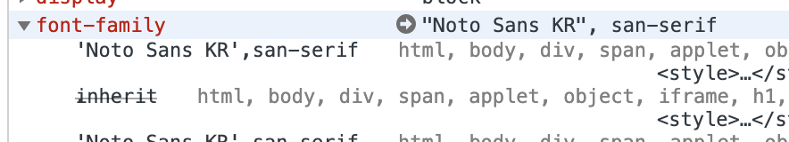
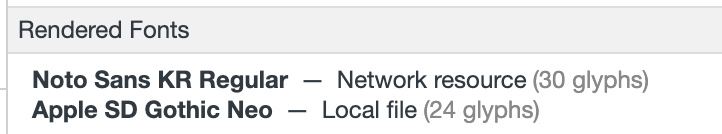
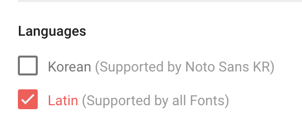

### index

- [gatsby에서 google webfont 사용하기](#gatsby에서-google-webfont-사용하기)
- [플러그인 설치하기](#플러그인-설치하기)
- [gatsby-config.js에 설정 추가](#gatsby-configjs에-설정-추가)
- [style 지정](#style-지정)
- [삽질](#삽질)
- [참고](#참고)


### gatsby에서 google webfont 사용하기

### 플러그인 설치하기
터미널에서 다음 명령어를 사용하여 구글폰트를 사용하기위한 플러그인을 프로젝트에 설치합니다.

``` shell
$ npm install --save gatsby-plugin-prefetch-google-fonts
```

### gatsby-config.js에 설정 추가
`gatsby-config.js` 파일의 plugins 배열에 `gatsby-plugin-prefetch-google-fonts`를 추가해줍니다.


``` javascript
module.exports = {
  plugins: [
    ...,
    ...,
    {
      resolve: `gatsby-plugin-prefetch-google-fonts`,
      options: {
        fonts: [
          {
            family: `Noto Sans KR`,
            variants: [`100`, `400`, `700`]
          }
        ],
      },
    },
    ...,
  ],
}
```

### style 지정

그리고 `css`에 font-family를 원하는 폰트로 설정해줍니다.

``` css
body {
  font-family: 'Noto Sans KR',san-serif;
}
```

### 삽질

#### 문제 발생



a ㅏ.. 분명 위 사진처럼 크롬 개발자도구의 `element > computed` 에서 확인하면 font-family가 `'Noto Sans KR',san-serif`로 적용되어있는데, 저번 jekyll로 만들어놨던 블로그와 비교해보니 한눈에봐도 폰트가 다릅니다..! 어떻게 된거지 한참을 찾아 헤맸어요.. ^_ㅠ


*'ㅎ'을 통해 비교할 수 있는 사진*

#### 원인 찾기


똑같은 태그, 똑같은 문장에서의 글자의 형태?(glyphs)가 jekyll 블로그에서 적용했던 문자는 모두 `Noto Sans KR Regular`로 적용된것에 비해 gatsby 블로그에서의 glyphs는 제 로컬 기본 폰트인 `Apple SD Gothic Neo` 까지 섞여있다는 사실이었습니다!

1. 여기서 왜 같은 폰트를 불러오는데 다른 결과가 나오지?
2. 네트워크에서 정말 똑같은 폰트를 불러오는지 확인해보자
3. 요청하는 url이 다르네?
4. [font.google.com][font-google-com]에서 한 폰트 내에서도 weight 말고도 구분하는 기준이 있나 확인해봐야겠다
5. `customize`탭에서 Korean을 체크하면 `link`태그의 attribute로 `subsets`가 생긴다.


> #### 삽질 1-1
> 
> 원인찾기 1번 과정에서 `oswald` 폰트를 요청하는 url 이 발견되었다.
> `gatsby-plugin-prefetch-google-fonts`의 예제에서 존재하던 폰트인데, 처음 예제코드 그대로 빌드해본 후 계속 잔재하는 요청이라고 생각했다. 
> 프로젝트 전체검색에 `oswald`를 검색해도 표시되지 않고 `node_modules`와 `.cache` 폴더를 지웠는데도 불구하고 자꾸 요청하는 것이다!!
> 
> 차분히 생각해보니,, 검색에서 잡히지 않던 이유는 `.gitignore` 파일에 명시되어 있어서 에디터에서 똑똑하게 스스로 거른것이었고, `public` 폴더에 font를 요청하는 코드가 따로 존재했다...
> 
> `node_modules`, `.cache`, `public` 폴더를 모두 지우고 새로 빌드하니 내가 명시한 폰드들만 잘 불러오더라는 후문,,


#### 원인 발견



그렇다.. [라이브러리의 설명][gatsby-plugin-prefetch-google-fonts-docs]에 명시되어있던 `subsets`를 간과한것이 문제였다.


#### 문제 해결

다시 `gatsby-config.js` 파일을 열고 다음과 같이 `subsets` 설정을 추가해주었다.


``` javascript
module.exports = {
  plugins: [
    ...,
    ...,
    {
      resolve: `gatsby-plugin-prefetch-google-fonts`,
      options: {
        fonts: [
          {
            family: `Noto Sans KR`,
            subsets: [`korean`],
            variants: [`100`, `400`, `700`]
          }
        ],
      },
    },
    ...,
  ],
}
```

새로 빌드할 때 마다 캐시된 파일들을 지우고 새로 빌드하자니 귀찮아서 `package.json`에 스크립트를 추가했다.

``` json
{
  "...": "...",
  "scripts": {
    "...": "...",
    "rmdev": "rm -rf node_modules/ .cache/ public/ && npm i && gatsby develop",
  },
  "...": "...",
}
```

``` shell
$ npm run rmdev
```

드디어 폰트가 정상적으로 출력된다!! ㅜㅜ

---

### 참고

- [gatsby-plugin-prefetch-google-fonts-docs][gatsby-plugin-prefetch-google-fonts-docs]
- [구글 웹폰트][font-google-com]


[gatsby-plugin-prefetch-google-fonts-docs]: https://www.gatsbyjs.org/packages/gatsby-plugin-prefetch-google-fonts/?=google
[font-google-com]: https://fonts.google.com