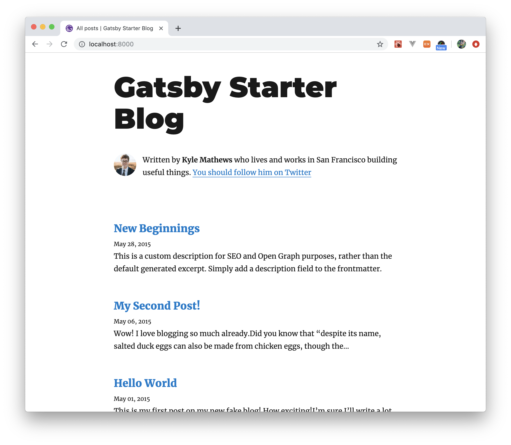

### index

- [gatsby로 블로그 시작하기](#gatsby로-블로그-시작하기)
- [github.io 주소 사용하기](#githubio-주소-사용하기)
- [블로그 배포하기](#블로그-배포하기)
- [참고](#참고)


### gatsby로 블로그 시작하기

#### gatsby-cli 설치하기
터미널에서 다음 명령어를 사용하여 gatsby-cli를 전역에 설치합니다.

``` shell
$ npm install -g gatsby-cli
```

#### 사이트 생성하기

``` shell
$ gatsby new [생성할 사이트 이름] [기본으로 가져올 소스코드 주소] <br>
```

이 명령어를 통해 개츠비에서 제공하는 기본구조의 사이트를 쉽게 생성할 수 있습니다.
`기본으로 가져올 소스코드 주소`를 명시하지 않으면 https://github.com/gatsbyjs/gatsby-starter-default 에 작성된 소스코드가 받아집니다.

[Gatsby Starter][gatsby-starter] 여기서 더 많은 샘플을 고를 수 있습니다.

저는 블로그가 목적이니 블로그 스타터를 사용해보겠습니다.


``` shell
$ gatsby new react-blog https://github.com/gatsbyjs/gatsby-starter-blog
```

다음 명령어를 통해 `localhost:8000`로 접속 가능합니다.

``` shell
$ cd react-blog && npm run develop
```




### github.io 주소 사용하기

다음 명령어를 실행하여 `package.json`의 `devDependencies`에 `gh-pages`를 추가해줍니다.

``` shell
$ npm install gh-pages --save-dev
```

#### github.io를 메인페이지로 사용하기

`package.json`의 `scripts`에 deploy 명령에 대한 내용을 추가해줍니다.

``` javascript
{
  "scripts": {
    ...,
    ...,
    "deploy": "gatsby build && gh-pages -d public -b master"
  }
}
```

이 방법에서는 github pages를 위해 랜더링된 코드가 `master` 브랜치로 업로드되기 때문에 원래 우리의 react 코드는 새로운 브랜치를 만들어 따로 관리하는게 좋습니다.

``` shell
$ git checkout -b'source'
// Switched to a new branch 'source'
$ git add *
$ git commit -m'first commit'
$ git push origin source
```

`git checkout` 명령어는 다른 브랜치로 이동할 때 사용하는 명령어예요.
`-b` 라는 옵션을 붙이고 뒤에 텍스트 a를 입력하면 a라는 이름의 새로운 브랜치를 만들고 그 브랜치로 바로 이동합니다.


#### github.io/reponame 으로 연결하기

이 방법을 사용하려면 `gatsby-config.js`에 `pathPrefix`를 명시해야합니다.

``` javascript
module.exports = {
  ...,
  ...,
  pathPrefix: "/reponame",
}
```

`package.json`의 `scripts`에 deploy 명령에 대한 내용을 추가해줍니다.

``` javascript
{
  "scripts": {
    ...,
    ...,
    "deploy": "gatsby build --prefix-paths && gh-pages -d public"
  }
}
```


### 블로그 배포하기

``` shell
$ npm run deploy
```

이 명령어를 실행하면 전자의 경우에는 public 폴더가 `master` 브랜치에 업로드되고 내용이 github.io 에 출력됩니다.
후자는 랜더링된 코드가 `gh-pages` 브랜치에 업로드되고 내용이 github.io/reponame 에 출력됩니다.

---

### 참고

- [Gatsby Docs][gatsby-docs] <br>
- [Gatsby Starter][gatsby-starter] <br>
- [How Gatsby Works with GitHub Pages][gatsby-gh-pages]


[gatsby-docs]: https://www.gatsbyjs.org/docs/quick-start
[gatsby-starter]: https://www.gatsbyjs.org/starters/?v=2
[gatsby-gh-pages]: https://www.gatsbyjs.org/docs/how-gatsby-works-with-github-pages/
