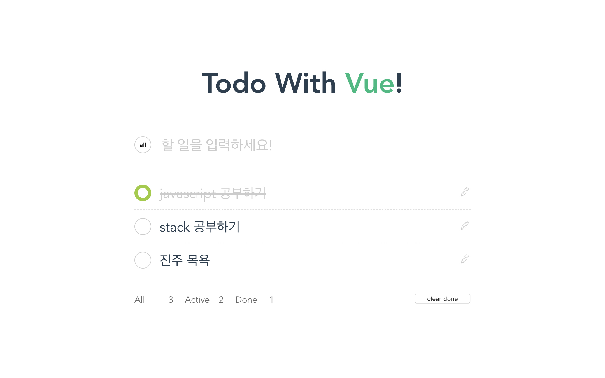

  

    

      <h3 class="title">todo list</h3>
      

        vue.js로 todo list 웹앱을 작성하였습니다.
        내용을 추가, 수정, 삭제 할 수 있으며 끝난 일정과 아직 진행중인 일정을 나누어서 확인할 수 있습니다.
      

    

    
  

  

    <video class="screenshot screenshot-1" autoplay muted loop>
      <source src="./vtodo_video1.mp4" type="video/mp4">
      Your browser does not support the video tag.
    </video>
    <video class="screenshot screenshot-2" autoplay muted loop>
      <source src="./vtodo_video2.mp4" type="video/mp4">
      Your browser does not support the video tag.
    </video>
  

